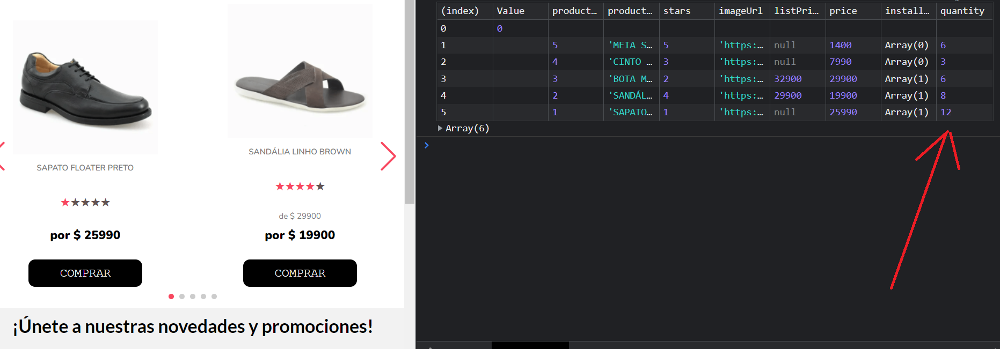

# USO PARA PRUEBA TECNICA COREBIZ
[]()


- Una vez descargado el proyecto se debe ejecutar los siguientes comandos
```sh
cd app
npm install
npm run dev
```

#####PD: para visualizar el aumento en la cantidad de productos, se debe ver en consola.

[]()